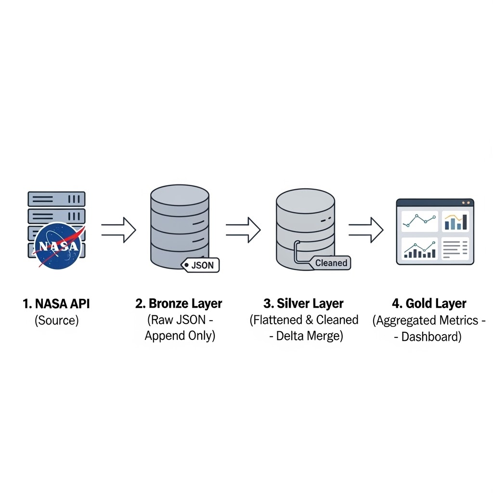

# 🛰️ NASA Planetary Defense: Automated Data Pipeline

A production-grade Medallion Architecture pipeline on Databricks, automating daily tracking of Near-Earth Objects (NEOs) to identify potential planetary threats.

---

## Project Overview
This project implements an end-to-end data engineering lifecycle: from raw astronomical telemetry ingestion via the NASA NeoWs API to a professional Databricks SQL dashboard. It solves the challenge of handling complex, nested JSON data at scale while ensuring data reliability through incremental watermarking and Delta Lake MERGE operations.

**API Reference:**  
- [NASA NeoWs (Near Earth Object Web Service) API](https://api.nasa.gov/)  
- [NeoWs API Documentation](https://api.nasa.gov/neo/)  
- Example endpoint: `https://api.nasa.gov/neo/rest/v1/feed?start_date=YYYY-MM-DD&end_date=YYYY-MM-DD&api_key=YOUR_KEY`

---

## Technical Architecture

NASA API (Source) --> Bronze Layer (Raw JSON - Append Only) ---> Silver Layer (Flattened & Cleaned - Delta Merge) ---> Gold Layer (Aggregated Metrics - Dashboard)

  
---
## Usage Instructions

1. **Prerequisites:**
   * Databricks Community Edition workspace (AWS)
   * Unity Catalog permissions for data governance
   * Python environment (for local API tests: `json`, `requests` libraries)

2. **Setup:**
   * Clone this repo into Databricks using the "Repos" feature.
   * Upload sample images (from `/databricks/` folder) for visuals if you wish to replicate screenshots.

3. **Pipeline Execution:**
   * Run the provided notebooks starting from Bronze Ingestion → Silver Transformation → Gold Aggregation.
   * Trigger Databricks Workflow (/Job) for daily end-to-end automation.
   * Check watermark columns to ensure incremental ingestion.

4. **Dashboard Access:**
   * Open "NASA Asteroid Threat Monitoring" dashboard in Databricks SQL.
   * Filter results by date or other threat metrics.

5. **Troubleshooting:**
   * Review error logs in the notebook output or Databricks Job UI.
   * For API schema changes, update Silver layer transformation logic and watermarking.

---
