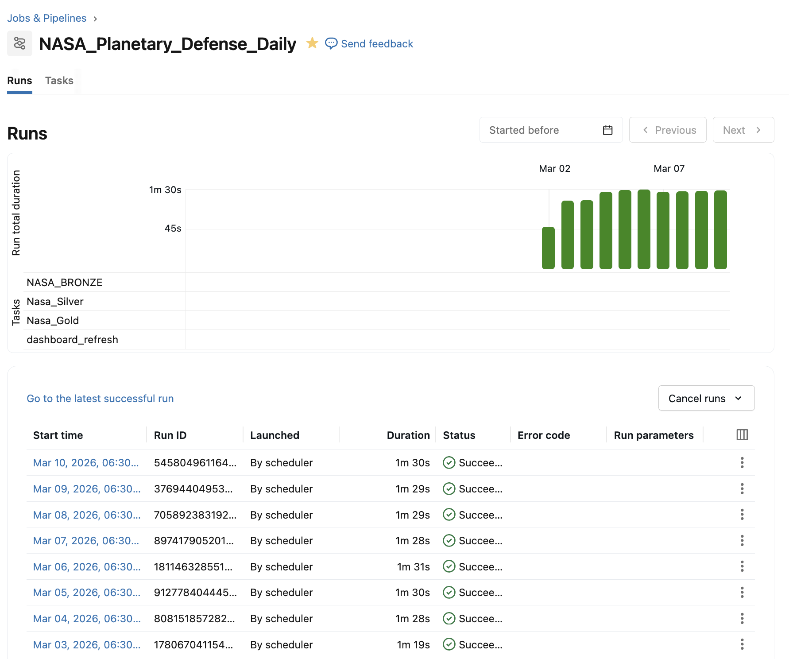
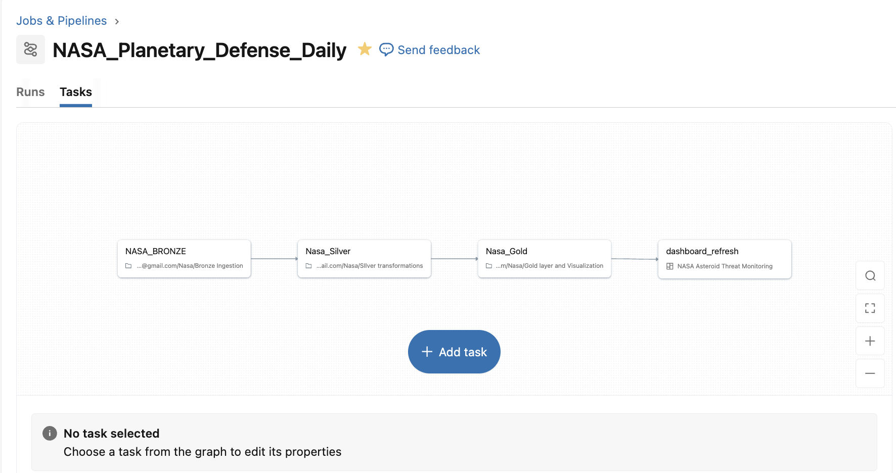
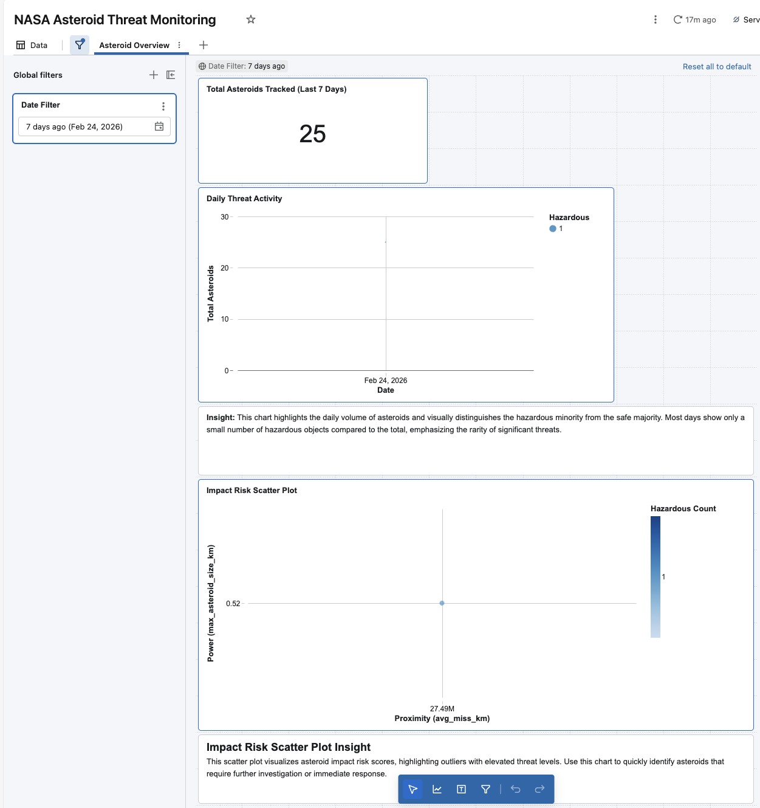
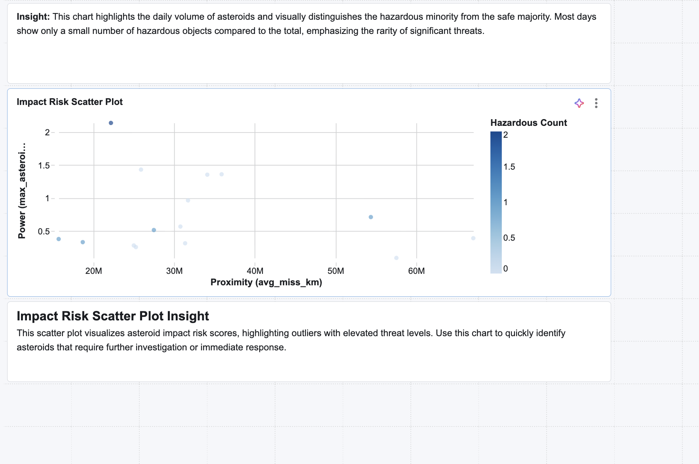

# 🛰️ NASA Planetary Defense: Automated Data Pipeline

A production-grade Medallion Architecture pipeline on Databricks, automating daily tracking of Near-Earth Objects (NEOs) to identify potential planetary threats.

---

## Project Overview
This project implements an end-to-end data engineering lifecycle: from raw astronomical telemetry ingestion via the NASA NeoWs API to a professional Databricks SQL dashboard. It solves the challenge of handling complex, nested JSON data at scale while ensuring data reliability through incremental watermarking and Delta Lake MERGE operations.

---

**API Reference:**  
- [NASA NeoWs (Near Earth Object Web Service) API](https://api.nasa.gov/)  
- [NeoWs API Documentation](https://api.nasa.gov/neo/)  
- Example endpoint: `https://api.nasa.gov/neo/rest/v1/feed?start_date=YYYY-MM-DD&end_date=YYYY-MM-DD&api_key=YOUR_KEY`

## Technical Architecture

NASA API (Source) --> Bronze Layer (Raw JSON - Append Only) ---> Silver Layer (Flattened & Cleaned - Delta Merge) ---> Gold Layer (Aggregated Metrics - Dashboard)

  
---

## Tech Stack

 Component     | Technology                             |
-------------- |----------------------------------------|
 Platform      | Databricks Community Edition (AWS)      |
 Governance    | Unity Catalog                          |
 Storage       | Delta Lake                             |
 Processing    | PySpark, Python (`json`, `requests`)    |
 Orchestration | Databricks Workflows                    |
 Visualization | Databricks SQL Dashboards               |

---

## Key Engineering Challenges

* **Serverless RDD Limitations:** Overcame Databricks Serverless compute restrictions (RDD/SparkContext limitations) by refactoring JSON parsing to a Python-native dictionary flattening method.
* **Incremental Data Integrity:** Implemented a Watermark-based strategy to prevent duplicate API ingestion, ensuring that only new rows from Bronze are processed each day.
* **Schema Evolution:** Handled dynamic NASA API keys (dated dictionaries) by flattening them into a consistent tabular format in the Silver layer.

---

## Technical Details

The pipeline leverages Databricks Medallion Architecture for robust data management:

- **Bronze Layer:** Raw JSON data from NASA NeoWs API is ingested and stored in append-only Delta tables. This layer preserves the original schema and enables traceability.
- **Silver Layer:** Data is cleaned and flattened using Python-native methods to handle nested structures and dynamic keys. Delta Lake MERGE operations are used for incremental updates, ensuring only new data is processed based on watermark columns.
- **Gold Layer:** Aggregated metrics and threat analysis are computed for dashboarding. The Gold layer powers Databricks SQL dashboards for real-time visualization.

**Orchestration:** Databricks Workflows automate daily ingestion, transformation, and dashboard refresh. Unity Catalog ensures governance and access control.

**Reliability:** The pipeline is resilient to schema changes and API anomalies, with error handling and logging integrated throughout.

---

## Proof of Success

* **Workflow Success:**
  * 
  * 

* **Dashboard Visualization:**
  * 
  * 
---

## Usage Instructions

1. **Prerequisites:**
   * Databricks Community Edition workspace (AWS)
   * Unity Catalog permissions for data governance
   * Python environment (for local API tests: `json`, `requests` libraries)

2. **Setup:**
   * Clone this repo into Databricks using the "Repos" feature.
   * Upload sample images (from `/databricks/` folder) for visuals if you wish to replicate screenshots.

3. **Pipeline Execution:**
   * Run the provided notebooks starting from Bronze Ingestion → Silver Transformation → Gold Aggregation.
   * Trigger Databricks Workflow (/Job) for daily end-to-end automation.
   * Check watermark columns to ensure incremental ingestion.

4. **Dashboard Access:**
   * Open "NASA Asteroid Threat Monitoring" dashboard in Databricks SQL.
   * Filter results by date or other threat metrics.

5. **Troubleshooting:**
   * Review error logs in the notebook output or Databricks Job UI.
   * For API schema changes, update Silver layer transformation logic and watermarking.

---
